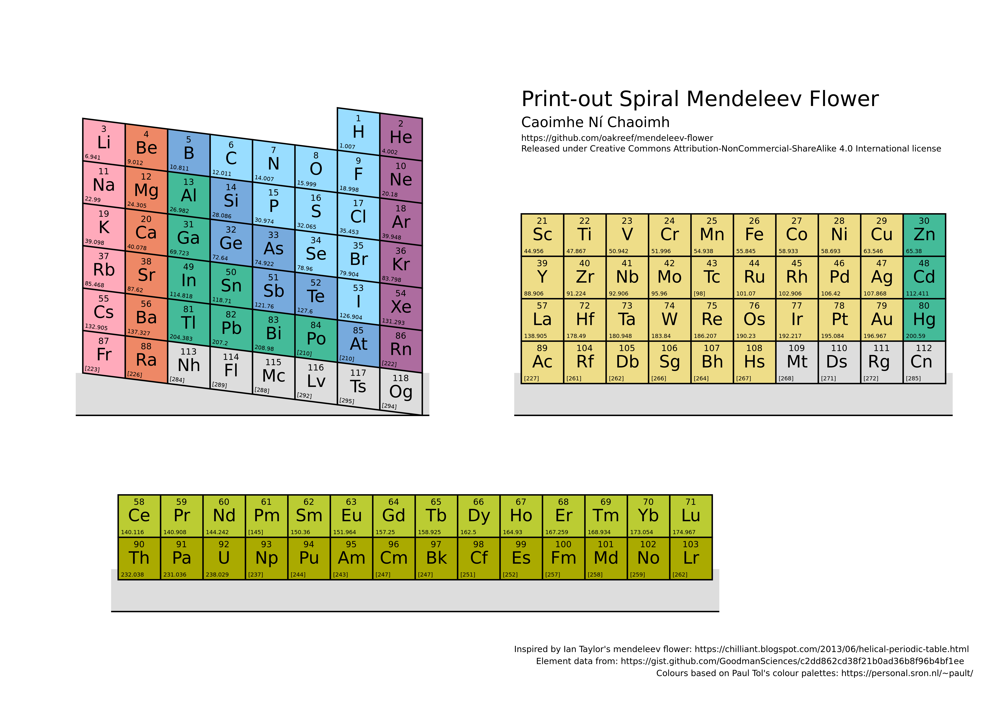

# Spiralling Mendeleev Flower by Caoimhe Ní Chaoimh

Design intended for spiralling, 3D period table, inspired by [Ian Taylor's mendeleev flower]. Print it out and glue it together.

Element data from [GoodmanSciences].

Colours, with modification, from [Paul Tol's colour palettes].

Released under [Creative Commons Attribution-NonCommercial-ShareAlike 4.0 International license][CC BY-NC-SA 4.0]

[Ian Taylor's mendeleev flower]: https://chilliant.blogspot.com/2013/06/helical-periodic-table.html
[GoodmanSciences]: https://gist.github.com/GoodmanSciences/c2dd862cd38f21b0ad36b8f96b4bf1ee
[Paul Tol's colour palettes]: https://personal.sron.nl/~pault/
[CC BY-NC-SA 4.0]: https://creativecommons.org/licenses/by-nc-sa/4.0/
